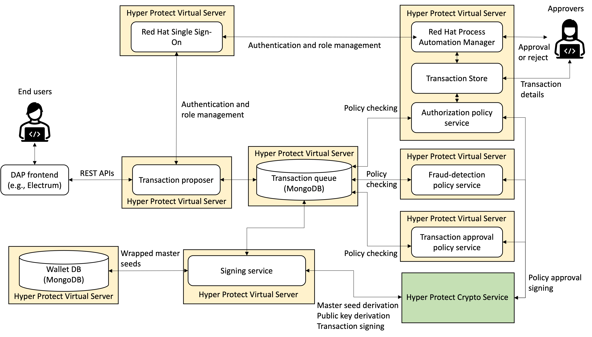

# Digital Asset Platform Blueprint

## Contents

- [Digital Asset Platform Blueprint](#digital-asset-platform-blueprint)
  - [Contents](#contents)
  - [Overview](#overview)
  - [Prerequisites](#prerequisites)
  - [Local Build](#local-build)
  - [Local Deployment](#local-deployment)
  - [Secure Build](#secure-build)
  - [Deployment of DAP Blueprint on IBM Cloud Hyper Protect Virtual Server for IBM Cloud VPC](#deployment-of-dap-blueprint-on-ibm-cloud-hyper-protect-virtual-server-for-ibm-cloud-vpc)
  - [Host name aliasing in /etc/hosts](#host-name-aliasing-in-etchosts)
  - [Two-Factor Authentication](#two-factor-authentication)
  - [DAP CLI](#dap-cli)
    - [CLI for Transaction Proposer REST APIs](#cli-for-transaction-proposer-rest-apis)
      - [Obtain a bearer token](#obtain-a-bearer-token)
      - [Obtain a bearer token with two-factor authentication](#obtain-a-bearer-token-with-two-factor-authentication)
      - [Obtain public keys of policy services](#obtain-public-keys-of-policy-services)
      - [Create a master seed](#create-a-master-seed)
      - [Derive a public key](#derive-a-public-key)
      - [Sign a transaction](#sign-a-transaction)
    - [Approval process in Red Hat Process Automation Manager (RHPAM)](#approval-process-in-red-hat-process-automation-manager-rhpam)
    - [CLI for Approval Server REST APIs](#cli-for-approval-server-rest-apis)
      - [Obtain a bearer token](#obtain-a-bearer-token-1)
      - [Obtain a bearer token with two-factor authentication](#obtain-a-bearer-token-with-two-factor-authentication-1)
      - [Obtain the details of a transaction](#obtain-the-details-of-a-transaction)
      - [Obtain transactions of a user within the specified hours](#obtain-transactions-of-a-user-within-the-specified-hours)
  - [How to use Electrum frontend](#how-to-use-electrum-frontend)
    - [Run an Electrum JSON RPC server for Bitcoin Testnet](#run-an-electrum-json-rpc-server-for-bitcoin-testnet)
    - [Electrum CLI](#electrum-cli)
      - [Cerate a wallet](#cerate-a-wallet)
      - [Load a wallet](#load-a-wallet)
      - [Get a un-used address of your wallet](#get-a-un-used-address-of-your-wallet)
      - [Get your balance](#get-your-balance)
      - [Create a transaction to send an amount of bitcoins](#create-a-transaction-to-send-an-amount-of-bitcoins)
      - [Get a signed transaction](#get-a-signed-transaction)
      - [Broadcast a signed transaction](#broadcast-a-signed-transaction)

<a id="overview"></a>

## Overview

This is an implementation of Digital Asset Platform Blueprint (DAP Blueprint).



An end user can send a REST API request to DAP Blueprint through a DAP frontend (e.g., bitcoin wallet like Electrum). You can use our [DAP CLI](#dap-cli) or [modified version of Electrum](#electrum) as the frontend. The followings describe how the REST API request from the frontend is processed in DAP Blueprint.

1. The transaction proposer is the endpoing for REST API requests from a DAP frontend. It authenticates a user with userid and password through Red Hat Single Sign-On (RHSSO). If the user is authorized by RHSSO, a bearer token is sent back to the DAP frontend. Other REST APIs in the transaction proposer can be called by using the bearer token. Transaction-proposer REST APIs can be found [here](https://ibm.github.io/dap-blueprint/). In addition, you can enable two-facator authentication in RHSSO. When the two-factor authentication is enabled, you can obtaine an one-time passcode through Google Authenticator or FreeOTP Authenticator. 

2. The transaction proposer enqueues a request in a transaction queue on Hyper Protect DBaaS.

3. Authorization, fraud-detection, and transaction-approval policy services dequeues a request from a transaction queue. Each policy service signs the request by using its own private key through Hyper Protect Crypto Service if the request satisfies pre-defined rules or models, and then enqueues the signed request in the transaction queue.

   - **Authentication policy service**: We implemented simple rules described [here](Authorization-Policy.md). When the request requires human approvals, the authentication policy service sends approval requests to approvers (sends e-mails to a [mailtrap](https://mailtrap.io/) account). Each approver can approve or reject the request through a Red Hat Process Automation Manager server which runs beside the authorization policy service. He/she can can overview a transaction in an approval request such as an amount to be sent. Further, he/she can obtain the details of the transaction through [REST APIs](https://ibm.github.io/dap-blueprint/).
   - **Fraud-detection policy service**: We implemented simple two rules. One of them rejects a transaction from a user who initiated transactions more than a threshold. The other rule rejects a transaction that tries to send bitcoins to an address that is used in the past.
   - **Transaction-approval policy service**: We implemented a simple rule which rejects any operation from malicious users. We hardcoded five users in a transaction proposer (alice, bob, charlie, eve, and mallory). Eve and mallory are hardcoded as malicious users in the transaction-approval policy service.

   When the request is approved or rejected, it is enqueued to the transaction queue. When the request is rejected, it is sent back to the transaction proposer. When the request is approved, it is processed by a signing service in Step 4.

4. Signing service dequeues a request from a transaction queue. It processes the request with accessing a wallet db on Hyper Protect DBaaS and HPCS if the request is signed by all of the policy services, and then enqueues a processing result in the transaction queue.

5. Transaction proposer dequeues a result from a transaction queue, and then sends back to a DAP frontend.

<a id="prerequisites"></a>

## Prerequisites

You need to set up the followings to build and deploy DAP Blueprint.

1. IBM Cloud Account (Pay as You Go)
   
   DAP Blueprint needs billing instances on IBM Cloud. So, you need Pay as You Go (PAYG) account for IBM Cloud at least.

2. API Key
   
   Create an API key in your account. We assume to use a single API key for every instance due to simplicity. However, this is not recommended in production. Please use an individual API key for each instance in production.

3. [Container Registry Name Space](https://cloud.ibm.com/docs/Registry)
   
   Create a new name space in IBM Container Registry to store your DAP Blueprint image. Please use **Dallas** region because only the Dallas region supports Docker Content Trust (DCT) which is needed to deploy Hyper Protect Virtual Server instances.

4. [Cloud Object Storage (COS) Instance and Buckets](https://cloud.ibm.com/objectstorage/create)
   
   Create a COS instance in **Dallas** region, and then create two buckets such as *dap-backup* and *wallet-backup*. These buckets are used to store the encrypted data for backup.

5. [Hyper Protect Crypto Services (HPCS) Instance](https://cloud.ibm.com/docs/hs-crypto)
   
   Create a HPCS instance and [initialize it](https://cloud.ibm.com/docs/hs-crypto?topic=hs-crypto-initialize-hsm-prerequisite). After initializing your HPCS instance, you should be able to obtain the following information.
   - Public Enterprise PKCS #11 endpoint URL (hostname starting from *ep11.*)
   - Instance ID

6. [Hyper Proetct DBaaS for MongoDB Certificate Authority](https://cloud.ibm.com/docs/hyper-protect-dbaas-for-mongodb?topic=hyper-protect-dbaas-for-mongodb-gettingstarted)
   
   Create a Hyper Protect DBaaS (HPDBaaS) instance manually (here)[https://cloud.ibm.com/catalog/services/hyper-protect-dbaas-for-mongodb]. At this time, you can create a free instance because this is not used in DAP Blueprint. This instance is needed only for downloading a certificate authority file. After creating an instance, you can download a certificate authority file from the overview page. After downloading the file, you can delete the instance.

7. [IBM Logging Instance](https://cloud.ibm.com/docs/vpc?topic=vpc-about-se#hpcr_setup_logging)
   
   Create an IBM loggin instance. After creating an instance, you should be able to obtain the following information.
   - Syslog server endpoint (hostname starting from *syslog.*)
   - Log server endpoint (hostname starting from *logs.*)
   - API endpoint (hostname starting from *api.*)
   - Ingestion key

8. [Red Hat Customer Portal Account](https://access.redhat.com/)
   
   Create an account in Red Hat Customer Portal. After creating an account, you should be able to obtain the following information.
   - Userid (your e-mail address)
   - Password

9.  [mailtrap Account](https://mailtrap.io/)
    
    Create an account in mailtrap, and then click **My Inbox**. After that, you should be able to obtain the following information from the **Credentials** tab in **SMTP Settings**. Our policy services send e-mail notifications to this SMTP server.
    - Username
    - Password    

10. Docker Environment (Optional)
    
    You can try to run DAP Blueprint on your laptop for test purpose. If you have a local Docker environment, you can build DAP Blueprint image and deploy it on your laptop.

<a id="local-build"></a>

## Local Build

This is a procedure to build a DAP Blueprint image in your laptop or Linux machine. Note that this procedure is only for test purpose. In production, please follow the [secure build procedure](#secure-build).

1. Clone this repo
   
   ```
   # git clone https://github.com/IBM/dap-blueprint.git
   # cd dap-blueprint
   ```

2. Copy an environment-variable file
   
   ```
   cp .env.build.template .env.build
   ```

3. Fill environment variables in `.env.build`
   
   | Environment Variable  | Description                                                                 |
   | --------------------- | --------------------------------------------------------------------------- |
   | REGISTRY_URL          | URL of your IBM container registry (e.g., us.icr.io). |
   | REGISTRY_NAMESPACE    | IBM container registry namespace which you created at Prerequisites 3 (e.g., dap-blueprint). |
   | DBAAS_CA              | HPDBaaS certificate authority which you downloaded at Prerequisites 6. Please paste the content of a downloaded certificate authority file without `-----BEGIN CERTIFICATE-----` and `-----END CERTIFICATE-----`. |
   | BUILD_TIME_SECRET     | An arbitrary string used as a build-time secret. This secret is used to generate signing and encryption keys with `DEPLOY_TIME_SECRET` which is specified at deploy time. |
   | OLD_BUILD_TIME_SECRET | A build-time secret used at the previous build. This is needed only for key rotation. In general, please keep empty like `OLD_BUILD_TIME_SECRET=`. |
   | REDHAT_EMAIL          | E-mail address in your Red Hat Customer Portal Account which you created at Prerequisites 8. |
   | REDHAT_TOKEN          | Password in your Red Hat Customer Portal Account which you created at Prerequisites 8. |

4. Run a build script
   
   ```
   # ./build-docker.sh
   # docker images
   ```
   You should be able to see you DAP Blueprint image named as `REGISTRY_URL/REGISTRY_NAMESPACE/dap-base`.

<a id="local-deploy"></a>

## Local Deployment

This is a procedure to deploy the DAP Blueprint image, which you built in the steps [here](#local-build)), in your local docker environment. Although you need to deploy six services in total, some services have dependencies. So, please follow the steps below carefully.

1. Install required os packages:

   ```
   apt install docker.io docker-compose jq python3 pip
   ```

1. Install required python libraries:

   ```
   python3 -m pip install -r ./requirements.txt
   ```

1. Create the docker external network

   ```
   docker network create dap-network
   ```

1. Copy an environment-variable file
   
   ```
   # cd dap-blueprint
   # cp .env.template .env
   ```

1. Fill environment variables in `.env`
   
    | Environment Variable                         |Description                                                                 |
    | -------------------------------------------- | -------------------------------------------------------------------------- |
    | RHSSO_HOST                                   | IP address of your Red Hat Single Sign-On (RHSSO) server. For local deployment, this is known after deploying a RHSSO server. So, please set 127.0.0.1 at this time. For cloud deployment, please set 10.X.Y.10. X and Y are different based on the region and zone which you choose. Please refer the address prefix [here](https://cloud.ibm.com/docs/vpc?topic=vpc-configuring-address-prefixes&locale=en). |
    | DAP_HOST                                     | IP address of your transaction proposer. For local deployment, this is known after deploying a transaction proposer. So, please set 127.0.0.1 at this time. For cloud deployment, please set 10.X.Y.23. X and Y are different based on the region and zone which you choose. Please refer the address prefix [here](https://cloud.ibm.com/docs/vpc?topic=vpc-configuring-address-prefixes&locale=en). |
    | IC_API_KEY                                   | IBM Cloud API key which you creatated at Prerequisites 2. |
    | REGION                                       | IBM Cloud region which you want to deploy your DAP Blueprint instances (e.g., jp-tok). This is not used for local deployment. |
    | ZONE                                         | IBM Cloud zone which you want to deploy your DAP Blueprint instances (e.g., 1). |
    | REGISTRY_USERNAME                            | Username to login IBM Cloud. This should be `iamapikey`. |
    | REGISTRY_PASSWORD                            | IBM Cloud API key which you creatated at Prerequisites 2. |
    | DBAAS_USER_ID                                | User ID to access your Hyper Protect DBaaS (HPDBaaS) instances. Set `admin`. |
    | DBAAS_API_KEY                                | IBM Cloud API key which you creatated at Prerequisites 2. |
    | DBAAS_RESOURCE_GROUP                         | IBM Cloud resource group which you want to create HPDBaaS instances (e.g., default). |
    | DBAAS_PLAN                                   | Plan name to create your HPDBaaS instances (e.g., mongodb-flexible). |
    | TXQUEUE_NAME                                 | HPDBaaS instance name for your transaction queue (e.g., dap-txqueue). |
    | WALLETDB_NAME                                | HPDBaaS instance name for your wallet DB (e.g., dap-walletdb). |
    | COS_API_KEY                                  | IBM Cloud API key which you creatated at Prerequisites 2. |
    | COS_ID                                       | ID of your cloud object storage (COS) instance. This is a string starting from `crn`. |
    | DAP_BACKUP_BUCKET                            | Bucket name to backup the DAP Blueprint data (e.g., dap-backup). Note that Bucket name must be unique in all of your COS instances. |
    | WALLET_BACKUP_BUCKET                         | Bucket name to backup the master seed of each wallet (e.g., wallet-backup). Note that Bucket name must be unique in all of your COS instances. |
    | LOGDNA_API_HOSTNAME                          | API hostname of your logging instance created at Prerequisites 7. |
    | LOGDNA_INGESTION_HOSTNAME                    | Ingestion hostname of your logging instance created at Prerequisites 7. |
    | LOGDNA_SYSLOG_INGESTION_HOSTNAME             | Syslog ingestion hostname of your logging instance created at Prerequisites 7. |
    | LOGDNA_INGESTION_KEY                         | Ingestion key of your logging instance created at Prerequisites 7. |
    | HPCS_API_KEY                                 | IBM Cloud API key which you creatated at Prerequisites 2. |
    | HPCS_ENDPOINT                                | End point of your Hyper Protect Crypto (HPCS) instance created at Prerequisites 5. This should be `https://iam.cloud.ibm.com`). |
    | HPCS_GUID                                    | GUILD of your HPCS instance created at Prerequisites 5. |
    | HPCS_ADDRESS                                 | Public Enterprise PKCS #11 endpoint URL of your HPCS instance created at Prerequisites 5. |
    | MAIL_USERNAME                                | Username of your mailtrap account created at Prerequisites 9. |
    | MAIL_PASSWORD                                | Password of your mailtrap account created at Prerequisites 9. |
    | SSH_PUBKEY_PATH                              | File path to your SSH public key (e.g., /home/john/.ssh/id_rsa.pub). This is an optional parameter to ssh to your DAP Blueprint containers for debugging. Keep empty in production use. |
    | DEPLOY_TIME_SECRET                           | An arbitrary string used as a deploy-time secret. This secret is used to generate signing and encryption keys with `BUILD_TIME_SECRET` which is specified at build time. |
    | OLD_DEPLOY_TIME_SECRET                       | A deploy-time secret used at the previous deployment. This is needed only for key rotation. In general, please keep empty like `OLD_DEPLOY_TIME_SECRET=`. |
    | ARGON2_SALT                                  | An arbitrary string used to generate signing and encryption keys with `BUILD_TIME_SECRET` and `DEPLOY_TIME_SECRET`. |
    | DAP_IMAGE                                    | Your DAP Blueprint image name. This should be REGISTRY_URL/REGISTRY_NAMESPACE/dap-base. |
    | NOTARY_URL                                   | Notary server URL for Docker Content Trust (DCT). When you use IBM Container Registry at Dallas, this URL should be `https://notary.us.icr.io`. This is not needed for local deployment. |
    | DCT_PUBKEY                                   | DCT public key when you used to push your DAP Blueprint image to IBM Container Registry. This is not needed for local deployment. |
    | RHSSO_ADMIN_PASSWORD                         | Admin password for your RHSSO server. |
    | RHPAM_ADMIN_PASSWORD                         | Admin password for your Red Hat Process Automation Manager (RHPAM) server. |
    | RHPAM_USER_PASSWORD                          | Password for users that are registered to your RHPAM server. Currently, DAP Blueprint registers five users: alice, bob, charlie, eve, and mallory. This is a tentative setting for simplification because all of the users have the same password. In production, different passwords should be registered for each user. |
    | RHPAM_APPROVER_PASSWORD                      | Password for approvers that are registered to your RHPAM server. Currently, DAP Blueprint registers three approvers: aimee, jon, katy. This is a tentative setting for simplification because all of the approvers have the same password. In production, different passwords should be registered for each approver. |
    | TRANSACTION_PROPOSER_PORT                    | Port of your transaction proposer. |
    | APPROVAL_SERVER_PORT                         | Port of your approval server. |
    | SIGNING_SERVICE_PORT                         | Port of your signing service. |
    | RHSSO_SSH_PORT                               | SSH port of your RHSSO container. This is only for test purpose. |
    | TRANSACTION_PROPOSER_SSH_PORT                | SSH port of your transaction proposer container. This is only for test purpose. |
    | AUTHORIZATION_POLICY_SERVICE_SSH_PORT        | SSH port of your authorization policy service container. This is only for test purpose. |
    | FRAUD_DETECTION_POLICY_SERVICE_SSH_PORT      | SSH port of your fraud detection policy service container. This is only for test purpose. |
    | TRANSACTION_APPROVAL_POLICY_SERVICE_SSH_PORT | SSH port of your transaction approval policy service container. This is only for test purpose. |
    | SIGNING_SERVICE_SSH_PORT                     | SSH port of your signing service container. This is only for test purpose. |

    You can see multiple environment variables that have IBM Cloud API key. For simplicity, we assumed to set the same API key for the environment variables. From a security perspective, you should create different API keys for each instance (service) and set them to the environment variables.

1. Run Red Hat Single Sign-On (RHSSO) Server
   
   ```
   # ./run-local.sh RHSSO
   ```

1. Inspect the RHSSO running container to find the `IPAddress` value and set the `RHSSO_HOST` environment variable in your `.env` file.

   ```
   # docker ps
   # docker inspect <Your RHSSO container name or ID>
   ```

1. Run Signing Service
   
   ```
   # ./run-local.sh SS False docker-build.log
   ```
   This command creates a container for signing service and two HPDBaaS instances (e.g., dap-txqueue, dap-walletdb). The second argument of this script specifies if you want to boot the service from scratch or reboot it. When `False` is specified, the signing service is booted from scratch. When `True` is specified, the signing service is rebooted from the backup information stored in your COS instance. We recommend `reboot` (i.e., `True` option) after you create the signing service once to reduce the fee for IBM Cloud.

   When you reboot the signing service, you can skip this step.

1. Run Transaction Proposer
   
   ```
   # ./run-local.sh TP False docker-build.log
   ```
   
1. Inspect the transaction proposer running container to find the `IPAddress` value and set the `DAP_HOST` environment variable in your `.env` file.

   ```
   # docker ps
   # docker inspect <Your transaction proposer container name or ID>
   ```

1. Run Other Services
   
   ```
   # ./run-local.sh AP False docker-build.log
   # ./run-local.sh FDP False docker-build.log
   # ./run-local.sh TAP False docker-build.log
   ```
   When you reboot these services and signing service, please simply run the following command.
   ```
   # ./run-local.sh
   ```

<a id="secure-build"></a>

## Secure Build

This is a procedure to build a DAP Blueprint image on [Secure Build Server](https://cloud.ibm.com/docs/hp-virtual-servers?topic=hp-virtual-servers-tutorial_secure_build_server).

1. Follow the steps decribed [here](https://cloud.ibm.com/docs/hp-virtual-servers?topic=hp-virtual-servers-tutorial_secure_build_server). In [4. Create the Secure Build Server configuration.](https://cloud.ibm.com/docs/hp-virtual-servers?topic=hp-virtual-servers-tutorial_secure_build_server#step_four), please copy the following contents to a file named `dap-config.json` and use the file as a configuration file after filling the parts specified by `< >`. The values of the `ARG` section are explained [here](#local-build).
   ```
   {
      "HOSTNAME": "dap.build.com",
      "CICD_PORT": "443",
      "IMAGE_TAG": "1.3.0.6",
      "CONTAINER_NAME": "dap-build",
      "GITHUB_KEY_FILE": "<Path to your GitHub public key file>",
      "GITHUB_URL": "git@github.com:IBM/dap-blueprint.git",
      "GITHUB_BRANCH": "main",
      "GITHUB_RECURSE_SUBMODULES": "True",
      "IMAGE_TAG_PREFIX": "dap-s390x",
      "REPO_ID": "dap-blueprint",
      "DOCKER_REPO": "dap-blueprint/dap-base",
      "DOCKER_USER": "iamapikey",
      "DOCKER_PASSWORD": "<IBM Cloud API key>",
      "DOCKER_RO_USER": "iamapikey",
      "DOCKER_RO_PASSWORD": "<IBM Cloud API key>",
      "DOCKER_CONTENT_TRUST_BASE": "False",
      "DOCKER_CONTENT_TRUST_BASE_SERVER": "",
      "DOCKER_BASE_SERVER": "us.icr.io",
      "DOCKER_PUSH_SERVER": "us.icr.io",
      "DOCKER_CONTENT_TRUST_PUSH_SERVER": "https://notary.us.icr.io",
      "DOCKERFILE_PATH": "Dockerfile",
      "DOCKER_BUILD_PATH": "",
      "ENV_WHITELIST": [
         "ZHSM",
         "ZHSM_CREDENTIAL",
         "SSH_PUBKEY",
         "DAP_SERVICE",
         "ARGON2_SALT",
         "DEPLOY_TIME_SECRET",
         "OLD_DEPLOY_TIME_SECRET",
         "DAP_REBOOT",
         "ENC_DBAAS_USER_ID",
         "ENC_DBAAS_TOKEN_AES_ENC_KEY",
         "ENC_DBAAS_TOKEN",
         "ENC_COS_API_KEY",
         "ENC_COS_ID",
         "ENC_HPCS_APIKey",
         "ENC_HPCS_Endpoint",
         "ENC_HPCS_Instance",
         "ENC_HPCS_address",
         "ENC_HPCS_CLIENT_KEY_AES_ENC_KEY",
         "ENC_HPCS_CLIENT_KEY1",
         "ENC_HPCS_CLIENT_KEY2",
         "ENC_HPCS_CLIENT_CERT_AES_ENC_KEY",
         "ENC_HPCS_CLIENT_CERT",
         "DAP_BACKUP_BUCKET",
         "WALLET_BACKUP_BUCKET",
         "SKIP_HPCS_VERIFY",
         "HPCS_INTERVAL",
         "RHSSO_HOST",
         "DAP_HOST",
         "LOGDNA_INGESTION_KEY",
         "LOGDNA_INGESTION_HOSTNAME",
         "LOGDNA_API_HOSTNAME",
         "TXQUEUE_NAME",
         "WALLETDB_NAME",
         "MAIL_USERNAME",
         "MAIL_PASSWORD",
         "DBAAS_RESOURCE_GROUP",
         "RHSSO_ADMIN_PASSWORD",
         "RHPAM_ADMIN_PASSWORD",
         "RHPAM_USER_PASSWORD",
         "RHPAM_APPROVER_PASSWORD"
      ],
      "ARG": {
         "NO_GRPC_BUILD": "1",
         "ACCESS_TOKEN": "<GitHub access token>",
         "BUILD_TIME_SECRET": "<Build-time secret>",
         "OLD_BUILD_TIME_SECRET": "",
         "REDHAT_EMAIL": "<E-mail address of your Red Hat Customer portal account>",
         "REDHAT_TOKEN": "<Password of your Red Hat Customer portal account>",
         "DBAAS_CA": "<Content of Hyper Protect DBaaS certificate authority file without -----BEGIN CERTIFICATE----- and -----END CERTIFICATE----->"
      }
   }
   ```

2. Save build log
   
   After [6. Wait until the build completes.](https://cloud.ibm.com/docs/hp-virtual-servers?topic=hp-virtual-servers-tutorial_secure_build_server#build_complete), save the build log by running the following command.
   ```
   # ./build.py ./build.py log --log build --env dap-config.json > docker-build.log
   ```
   
3. Obtain Docker Content Trust (DCT) public key
   
   ```
   # build.py get-dct-publickey --config dap-config.json > dct-pubkey.txt
   ```

4. Clone this repo
   
   ```
   # git clone https://github.com/IBM/dap-blueprint.git
   # cd dap-blueprint
   ```

5. Copy docker-build.log to your cloned directory
   
   ```
   # cp ${SECURE_BUILD_CLI_DIR}/docker-build.log ./
   ```

6. Copy an environment-variable file
   
   ```
   # cp .env.template .env
   ```

7. Fill environment variables in `.env`
   
   Description of each environment variable is [here](#local-build). For NOTARY_URL and DCT_PUBKEY, please set `https://notary.us.icr.io` and the DCT public key obtained at Step 3.

8. Create encrypted contract files
   
   ```
   ./create-contract.sh False docker-build.log
   ```
   Please sepcify `True` as the second argument when you reboot DAP Blueprint services. This command creates the following six encrypted contract files under `terraform/`. You can deploy DAP Blueprint services on [IBM Cloud Hyper Protect Virtual Server for IBM Cloud VPC](https://cloud.ibm.com/docs/vpc?topic=vpc-about-se) by using terraform scripts and these encrypted contract files.
   - rhsso.yml (RHSSO)
   - tp.yml (Transaction Proposer)
   - ap.yml (Authorization Policy Service)
   - fdp.yml (Fraud Detection Policy Service)
   - tap.yml (Transaction Approval Policy Service)
   - ss.yml (Signing Service)

<a id="vpc-deploy"></a>

## Deployment of DAP Blueprint on IBM Cloud Hyper Protect Virtual Server for IBM Cloud VPC

This is a procedure to deploy DAP Blueprint on [IBM Cloud Hyper Protect Virtual Server for IBM Cloud VPC](https://cloud.ibm.com/docs/vpc?topic=vpc-about-se). For deployment, you need to finish all of the [steps in secure build](#secure-build).

1. Run Red Hat Single Sign-On (RHSSO) server
   
   ```
   # cd dap-blueprint
   # ./run.sh RHSSO False docker-build.log
   ```
   The second argument of this script specifies if you want to boot all of the services from scratch or reboot them. When `False` is specified, all of the services are booted from scratch. When `True` is specified, all of the services are rebooted from the backup information stored in your COS instance. We recommend `reboot` (i.e., `True` option) after you created all of the services once to reduce the fee for IBM Cloud.
   
   This script outputs an IP address of this RHSSO server. The following is an example output.
   ```
   rhsso_ip = "xxx.xxx.xxx.xxx"
   ```
   Please set this IP address to an environment variable `RHSSO_HOST` in the `.env` file and then run the following command.
   ```
   # ./create-contract.sh
   ```
   This command re-creates encrypted contract files with a correct `RHSSO_HOST`.

   You can check if the deployment succeeds in your logging instance.

2. Run Signing Service
   
   ```
   # ./run.sh SS False docker-build.log
   ```
   This command deploys a signing service and two HPDBaaS instances (e.g., dap-txqueue, dap-walletdb). The second argument of this script specifies if you want to boot the service from scratch or reboot it. When `False` is specified, the signing service is booted from scratch. When `True` is specified, the signing service is rebooted from the backup information stored in your COS instance. We recommend `reboot` (i.e., `True` option) after you create the signing service once to reduce the fee for IBM Cloud.

   You can skip this step when you reboot the signing service.

3. Run Transaction Proposer
   
   ```
   # ./run.sh TP False docker-build.log
   ```
   This script outputs an IP address of transaction proposer. The following is an example output.
   ```
   transaction_proposer_ip = "xxx.xxx.xxx.xxx"
   ```
   Please set this IP address to an environment variable `DAP_HOST` in the `.env` file and then run the following command.
   ```
   # ./create-contract.sh
   ```
   This command re-creates encrypted contract files with a correct `DAP_HOST`.

4. Run Other Services
   
   ```
   # ./run.sh AP False docker-build.log
   # ./run.sh FDP False docker-build.log
   # ./run.sh TAP False docker-build.log
   ```
   These commands deploy three services: authorization policy service, fraud detection policy service, and transaction approval policy service.

   When you reboot these services and a signing service, please run the following command.
   ```
   # ./run.sh
   ```
   This command deploys four services: authorization policy service, fraud detection policy service, transaction approval policy service, and signing service.

<a id="hostname"></a>

## Host name aliasing in /etc/hosts

All of the services in DAP Blueprint authenticate users through Red Hat Single Sign-On (RHSSO). In the authentication process, multiple redirections occur between a service and RHSSO. At that time, RHSSO verifies if the redirected URLs are valid. In DAP Blueprint, specific host names are used for the redirected URLs. Therefore, please set the following host names in your `/etc/hosts`.

rhsso-host      <IP address of your RHSSO server>
dap-host        <IP address of your transaction proposer>
rhpam-host      <IP address of your authorization policy service>
approval-host   <IP address of your authorization policy service>

When you deploy DAP Blueprint locally, please set `127.0.0.1` to all of the above addresses. When you deploy DAP Blueprint on IBM Cloud Hyper Protect Virtual Server for IBM Cloud VPC, please obtain the IP addresses from the outputs of `./run.sh`.

<a id="2fa"></a>

## Two-Factor Authentication

Each user can enable two-factor authentication on RHSSO by accessing the following URL.

```
https://rhsso-host:8543/auth/realms/rhpam/account/
```

In this URL, you should see the QR code in the `Authenticator` section. Please scan this QR code through Google Authenticator or FreeOTP Authenticator. You should be able to obtain an one-time passcode. Inputting the passcode enables the two-factor authentication.

<a id="dap-cli"></a>

## DAP CLI

```dap_client.py``` under ```dap-blueprint/src/dap_client``` is a command-line interface (CLI) for REST APIs of a transaction proposer and an approval server. It has two global options ```--host``` and ```--port``` to specify a host name (IP address) and a port number for the transaction proposer. For example, when the host name is ```transaction-proposer-host``` and the port number is ```5000```, please run ```./dap_client.py --host dap-host --port 5000 <command> <options>```.

### CLI for [Transaction Proposer REST APIs](https://ibm.github.io/dap-blueprint/)

<a id="login"></a>

#### Obtain a bearer token

```
./dap_client.py login admin xxxxxxx
```

This command stores a bearer token in a file `.dap.tmp/admin.token`. When the token is expired, please run the `login` command again. Obtaining a token for admin is needed to obtain a public key of policy services. When you create a master seed as a user, please run the following command to obtain a token for alice.

```
./dap_client.py login alice xxxxxx
```

You can use the other four userids bob, charlie, eve, and mallory with the same password. As mentioned above, eve and mallory are hardcoded as malicisous users in a transaction-approval policy service.

<a id="login_2fa"></a>

#### Obtain a bearer token with two-factor authentication

```
./dap_client.py login_2fa admin xxxxxx 123456
```

The third argument is an one-time passcode which can be obtained from Google Authenticator or FreeOTP Authenticator.

<a id="pubkeys"></a>

#### Obtain public keys of policy services

```
./dap_client.py service_statuses admin
```

This command stores a public key of a policy service in a file `.dap.tmp/<policy service name>.pubkey`.

#### Create a master seed

```
./dap_client.py create_seed alice
```

You should be able to see the following response.

```
{'seedid': <Your seed id>, 'status': 'ok'}
```

#### Derive a public key

```
./dap_client.py derive_pubkey charlie <Your seed id> "m/1/2"
```

You should be able to see the following response.

```
{'chaincode': <A hash of your public key>'f8073c925c6e0b95a7c3aee6d8a124a1657d4ce383f0b692a16aed9d7833e450',
 'pubkey': <A hex number to represent a public key>,
 'status': 'ok'}
```

#### Sign a transaction

```
./dap_client.py sign alice <Your seed id> ./sample_transaction.json
```

You need to define a transaction in a json file `sample_transaction.json` like:

```
{
    "transaction": <A raw transaction in the hex number>, 
    "inputs": [{"bip32path": "m/1/2", "hash": <A hash value to be signed>}]
}
```

You should be able to see  the following response.

```
{'signs': [<A signature for your input in the hex number>],
 'status': 'ok'}
```


### Approval process in Red Hat Process Automation Manager (RHPAM)

When your transaction meets one or more rules defined in a RHPAM server, e-mail notifications are sent to approvers (in your mailtrap account). Each notification has a URL for the RHPAM server. You can login the RHPAM server by accessing the URL in your browser. After login, you should see the following page.


From this pager, please select `Menu ==> Task inbox`. After that, you should be able to find your task as follows.


This is the list of approval requests assigned to you. If you open a task, you should see the content of an approval request as follows.


In the `Details` tab, you can obtain `Process Instance Id` which can be used to query the transaction in detail through approval server REST APIs described later.

In the `Work` tab, you can start an approval process by clicking `Claim ==> Start`. After that you can edit the `Amount_approved` check box. After that, you can complete the approval process by clicking `Complete`.

### CLI for [Approval Server REST APIs](https://ibm.github.io/dap-blueprint/)

#### Obtain a bearer token

```
./dap_client.py --port 5001 login chris xxxxxx
```

You can use the other two userids jon and vlad as approvers with the same password.

#### Obtain a bearer token with two-factor authentication

```
./dap_client.py login_2fa admin xxxxxx 123456
```

The third argument is an one-time passcode which can be obtained from Google Authenticator or FreeOTP Authenticator.

#### Obtain the details of a transaction

```
./dap_client.py --port 5001 tx_details chris <a row transaction in hex>
```

You should be able to see the following response.

```
{
    "userid": <user id who initiated this transaction>
    "amount": <an amount of bitcoins to be sent in this transaction>,
    "daily_amount": <an amount of bitcoins sent and to be sent by this user within 24 hours>,
    "psbt": <a deserialized PSBT>,
    "status": "You are requested to approve or reject this transaction for <rule name>, ...."
}
```

#### Obtain transactions of a user within the specified hours

```
./dap_client.py --port 5001 user_txs chris <a user id who initiated a transaction> <hours>
```

You should be able to see the following response.

```
{
    "transactions": [<a row transaction in hex>, ...]
    "status": "The first <n> transactions are waiting for your signs."
}
```

In the above transaction list, the first **n** transactions are waiting for your signing. The remaining transactions are already signed and broadcasted in a bitcoin network.

<a id="electrum"></a>

## How to use Electrum frontend

Our enhanced Electrum is included in a dap-blueprint image. If you build a dap-blueprint image in the steps [here](#local-build), you can run the enhanced Electrum in your laptop as a frontend to DAP Blueprint. The enhanced Electrum calls REST APIs of transaction proposer to create a master seed, derive a public key, and sign a transaction for bitcoin transactions. After signing a transaction, you can broadcast the signed transaction to a bitcoin network.

### Run an Electrum JSON RPC server for Bitcoin Testnet

```
# cd dap-blueprint
# cd ./run-electrum.sh
```
Note that you need to have `.env` file that you used to deploy dap-blueprint services under the dap-blueprint directory. Since the Electrum server accesses a transaction proposer, it needs to know the IP address and port of the transaction proposer, which should be set in the `.env` file.

### Electrum CLI

```electrum_client.py``` under ```dap-blueprint/src/dap_util``` is a command line interface (CLI) to call JSON RPCs of our enhanced Electrum. Using the CLI allows you to perform the following operations.

#### Cerate a wallet

```
./electrum_client.py create_dap <userid (alice, bob, or charlie)> <password> 
```

Currently, only three userids (alice, bob, and charlie) can be used with a password `passw0rd` (0 is zero). The password is used for authentication to transaction proposer. 

#### Load a wallet

```
./electrum_client.py load_wallet <userid>
```

#### Get a un-used address of your wallet

```
./electrum_client.py getunusedaddress <userid>
```

#### Get your balance

```
./electrum_client.py getbalance <userid>
```

#### Create a transaction to send an amount of bitcoins

```
./electrum_client.py payto <userid> <destination address> <an amount of bitcoins>
```

#### Get a signed transaction

```
./electrum_client.py getsignedtx <userid> <a raw transaction in hex (PSBT)>
```

#### Broadcast a signed transaction

```
./electrum_client.py broadcast <a raw transaction in hex>
```

