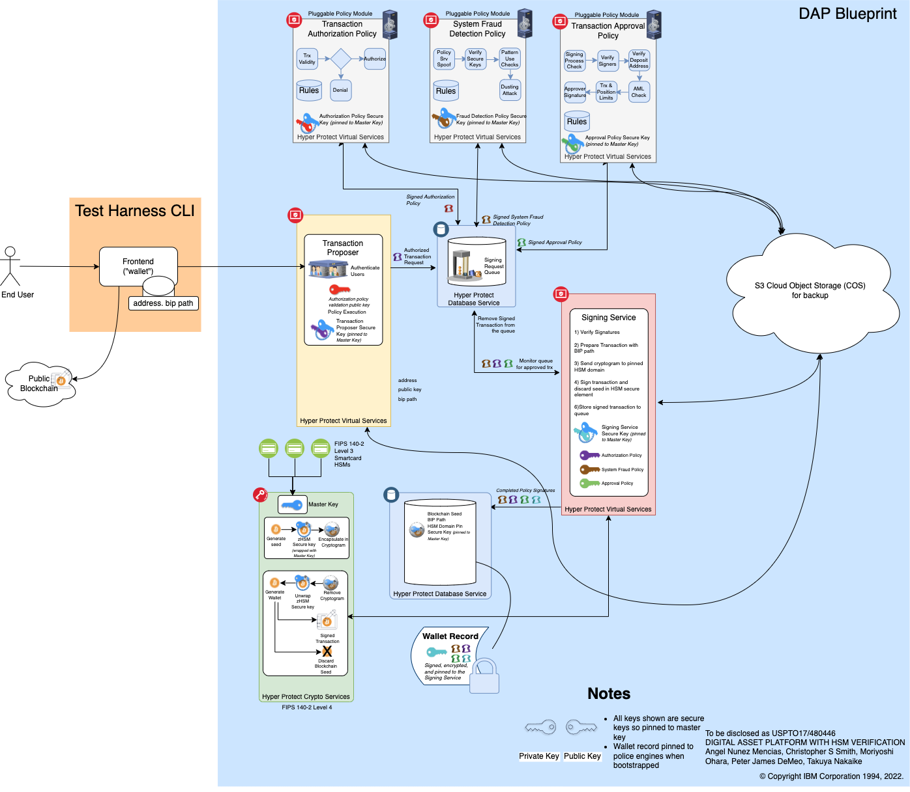

# Digital Asset Platform Blueprint

This repo maintains the document and code to define Digital Asset Platform Blueprint (dap blueprint).

This blueprint demonstrates how Hyper Protect services can be configured to provide a secure digital asset
signing service with technical assurance where even administrators cannot compromise the system.

This blueprint comes with a CLI script program, which includes a frontend wallet for testing purposes (e.g.
a modified Electrum for Bitcoin). A consumer of this blueprint is expected to replace the frontend with
a full-blown wallet implementation.

The current API design can be found [here](https://ibm.github.io/dap-blueprint/).

Also refer to [the transaction sequences](Transaction-Sequences.md) and [the threat model](Threat-Model.md) to understand the current design.

The procedure to build and deploy a dap blueprint can be found [here](Deploy.md)

  

