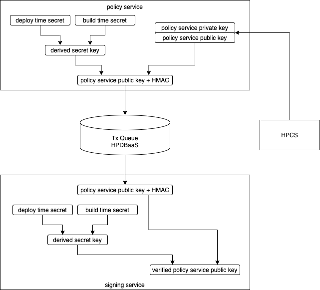
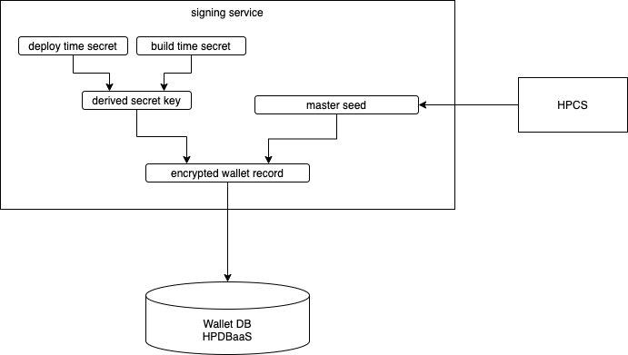
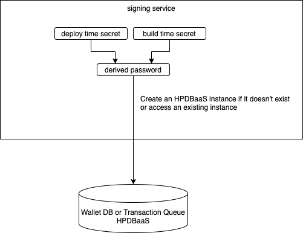

# Threat Model

## Personas

- Workload provider (aka service owner)

A person who has an ultimate responsibility to the digital asset service on the platform.

- Developer

One or more persons who develop and build the digital asset application to push container images to a container image repository. They have access to the images and any "secrets" embedded in the images.

- IBM admin

IBM admins who provide and manage IBM Cloud including the hyper protect environment. They can potentially access API calls (and their parameters) to IBM Cloud from user admins or other personas but 
cannot access HPVS, HPCS and HPDBaaS instances.

- User admin

User admins who configure, deploy and manage the digital asset application interacting with IBM Cloud. They can access all configuration parameters, such as access credentials for HPCS, 
and other secrets.

- Approver

Approvers who review and approve or reject digital asset transactions service when the rule engine in a policy service determines a human approval is necessary.

- End user

End users who access the digital asset service to make digital asset transactions.

## Claims

- Only end users who are authorized from the authorization service can make digital asset transactions, which can proceed to transaction signing only if all policy services (transaction authorization, 
system fraud detection, and transaction approval) approve the transaction. 

The signing service signs a digital asset transaction only if it finds a valid signature from all policy services. Each policy service generates a private and public key pair for the approval signature
within the service running in an HPVS instance during the initialization phase. Hence no one can access the private key. The public key is securely passed from each policy service to the signing service with HMAC.
No one can alter or replace the public key.

- Developers, who can access secrets in container images, cannot make digital asset transactions.

Developers cannot access master seeds, which are encrypted with a secret that developers don't have access.

- IBM admins, who can access API calls and their parameters to IBM Cloud, cannot make digital asset transactions. 

API calls and their parameters don't include enough information to make digital asset transactions.

- User admins, who can access configuration parameters (HPCS and HPDBaaS access credentials), cannot make digital asset transactions. 

Each wallet record containing a master seed is generated in the signing service and encrypted with a secret which is derived from two secrets, one from a user admin and the other from the image of signing service.
Unless a user admin colludes with a developer who can access the image, they cannot obtain the secret.

- Approvers, who can review digital asset transactions, cannot make digital asset transactions.

Signing keys or master seeds are not exposed to approvers.

## Policy Service Key Generation and Delivery

Approval signatures from each policy service and their validation at a signing service are the foundation of this digital asset platform. 

Each policy service (i.e. transaction authorization, 
system fraud detection, and transaction approval) generates a key pair only once at service startup. They can be partial keys of a multi-sig signing scheme.
The private keys are not stored in a persistent storage or a container image. In this way, we prevent the private key from being exposed to an admin or any human.

The signing service uses the policy service public key to verify the policy service signatures.  The signing service must receive these public keys in a secure way. The following diagram illustrates how this may be done using derived shared secrets and the transaction queue on HPDBaaS.
1) The services generate a derived secret key from at least two shared secrets.  For example, one shared secret can be given at a build time from a developer, and another at deploy time from a user admin. 
2) The policy service generates a HMAC (hash-based message authentication code) for their public key using the derived key.
3) The policy service passes the public key and HMAC to the signing service via the transaction queue on HPDBaaS.
3) The signing service verifies the integrity and authenticity of the public key by comparing the incoming HMAC with the HMAC it generates from the public key using its version of the derived key.

The derived secret key is available only inside the policy and signing services, unless there is collusion between the providers of the shared secrets (e.g. the developer and user admin).  If a malicious user admin tries to bring another policy service
from a different developer or to inject another public key through the transaction queue, the signing service will reject the public key because the HMAC authentication fails.

  

## Wallet Encryption

A wallet DB in HPDBaaS stores wallet records. Each record contains a master seed, a wallet id and possibly a few other meta data. The master seed is highly sensitive information because it works as a seed
to generate digital asset transaction signing keys. While the master seed is generated in an HPCS instance, hence is wrapped with its master key, we still need to protect it from unauthorized uses. 
Hence, each record is encrypted in such a way that it can be decrypted only in the signing service.  For this purpose, the signing service derives a symmetric encryption key from a secret embedded 
in the container image and another secret given from the workload provider when the service starts. Since the encryption key is generated in the signing service, no one can decrypt wallet records by accessing the Wallet DB. The following diagram illustrates how wallet records are encrypted.

  

## HPCS Access Credentials

Access credentials for HPCS are obtained by a user admin. Since they are exposed to human, no one should be able to make digital asset transactions using those credentials.
The access credentials however should not be exposed to a wider audience since they can lead to a DoS attack at the HPCS instance or can increase the risk when the signing service is compromised. 
The secure build process of each service (policy and signing services as well as the transaction proposer) generates a private and public key pair. The private key is stored in the container image and
the public key is exposed and passed to a user admin. The user admin encrypts the access credentials with the public key and passes them to IBM Cloud as an environment variable parameter
when each service is created as an HPVS instance. Unless an IBM admin and a developer collude, the access credentials won't be exposed from the user admin. 

## HPDBaaS Access Credentials

Access credentials for HPDBaaS, on the other hand, won't be exposed to a user admin or any human as a malicious person can use them to attack the digital asset platform, for example, by
deleting wallet records in the wallet DB to make digital assets inaccessible or injecting bogus transactions to the transaction queue to cause a DoS attack.
The signing service generates a password to access an HPDBaaS instance and creates the instance if it doesn't exist yet. The password is deterministically derived from two secrets: one given at build time
from a developer and another given at deploy time from a user admin. Unless the two persons collude, the password is not available to any human.
Other services (transaction authorization, system fraud detection, transaction approval, and transaction proposer) also obtain the same pair of secrets to derive the same password. 
The following diagram illustrates how the password is derived in the signing service.

  

