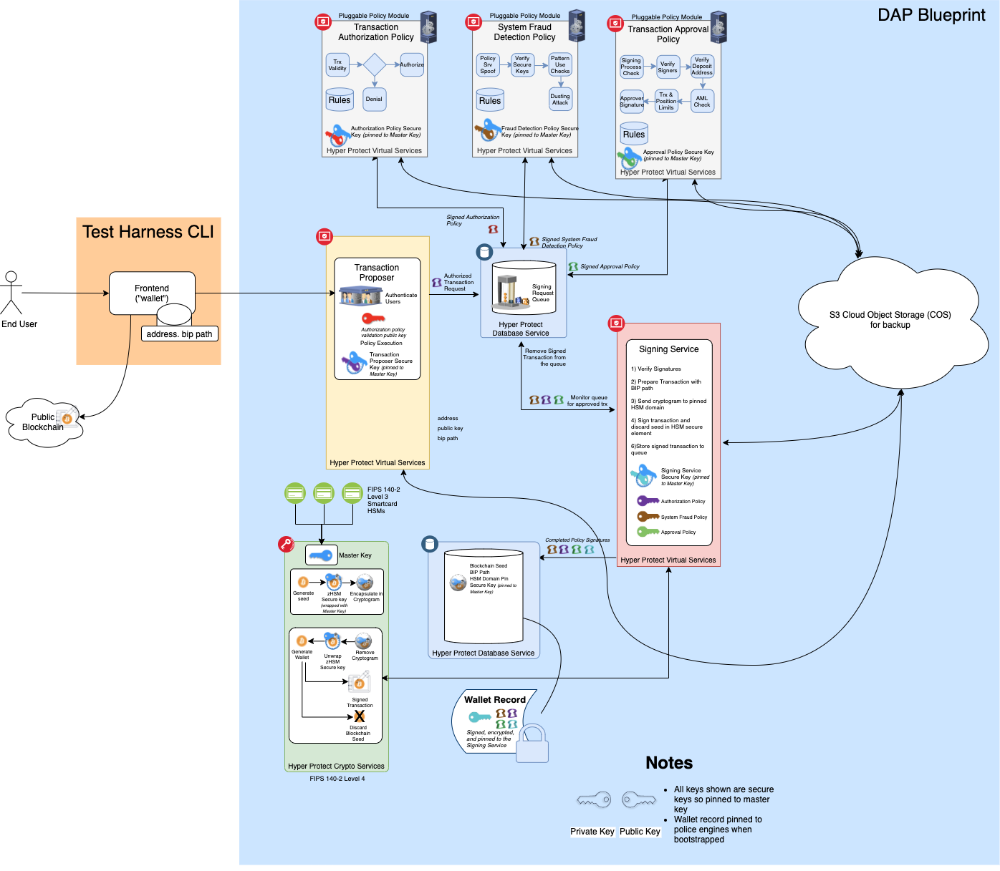
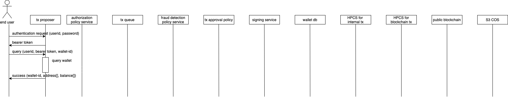

# Transaction Sequences

  

## Boot

Here is a list of high level assumptions and strategies to bring up a digital asset platform in a secure manner.

1. This blueprint includes five micro services, which consist of a signing service, a tx proposer, and three policy services (i.e. authorization, tx approval and fraud detection), running as an HPVS instance, two HPDBaaS instances (wallet db and
tx queue), two HPCS instances, and a COS service.
2. Each micro service uses a private and public key pair for approval signing or encryption/decryption. When a service is created for the first time, it generates a key pair on HPCS and creates an encrypted key-pair record with hmac.
The encrypted record is posted to COS for backup where only the workload provider can access.
Each micro service derives two common symmetric secret keys (encryption and signing keys) using two given secrets: build-time and deploy-time. The build-time secret is embedded in the container image from the build process. All of the five micro services need to have the same secret to derive the same keys. The deploy-time secret is given from a user admin. Thus, no single person can decrypt the backup record outside the service instance. The key derivation is deterministic to allow each service with the same secrets to restore the key pair from the backup record.
3. Each micro service also creates a public key with hmac. The user admin can download and share it with end users. When an end user calls a create wallet API, a set of public keys is passed to the tx proposer and eventually to the signing service, which checks the authenticity of each public key with the hmac to store them in a wallet record along with an encrypted master seed. When the seed is used later, the signing service retrieves all of the public keys in the record to verify a separate signature with each of the public keys.
4. When the signing service creates a new wallet record, it generates a master seed on HPCS and encrypts it with the public key of the signing service. Since its private key is not available outside the signing service, no one can retrieve the master seed outside the signing service. Only when a tx request has a set of valid signatures corresponding to each public key in the wallet record, the signing service decrypts the master seed.
5. When the signing service is created for the first time, it creates two HPDBaaS instances with a randomly generated password for each instance. The signing service creates a backup record with the database URLs and passwords and posts the encrypted record with hmac to COS for backup. Since the database passwords are available only in the micro services, no one can read, write or delete a record in those databases.
6. The workload provider has an ultimate responsibility to a service on the platform, and conducts a minimum set of initialization steps: to set up two HPCS instances (one for wallet seeds, and the other for approval signing and wallet record encryption/decryption) with a key ceremony,
to create an access token to allow the signing service to create HPDBaaS instances, to create an API key to access COS, and to create an API key to create HPVS instances. Each micro service has a secret encryption/decryption key pair generated during a build process. The workload provider encrypts access credentials for the two HPCS instances, the access token for HPDBaaS management, and the API key for COS with the public key. The encryption prevents the secrets from being exposed to the user and IBM admins. Each micro service uses its private key to decrypt them. As the access token is available only to the workload provider, no one else can delete or do other operations to the HPDBaaS instances. While the user admin can delete HPVS instances with the API key, as HPVS instances are state-less, the user admin can cause only temporary disruptions to the service (no digital asset lost).

### First Boot

This section describes a sequence to start a DAP blueprint instance from scratch except for two HPCS instances and a COS bucket which have been already set up.

  

### Reboot

This section describes a sequence to start DAP blueprint micro services with two existing HPBDaaS instances (wallet db and tx queue), which have been already created from a previous run.

  

## DAP transactions

### Create Wallet

1. An end user calls "create wallet" API with access credentials, and a set of public keys with hmac for policy services to approve or reject transactions for the wallet.
2. All policy services approve the wallet creation by signing the request.
3. The signing service verifies all public keys attached to the request with hmac.
4. The signing service verifies all signatures using the public keys.
5. The signing service generates a new master seed on HPCS for blockchain tx, which is encrypted with the public key of the signing service on HPCS for internal tx.
6. The signing service creates a new wallet record with a new wallet id as an index.
7. The signing service creates a wallet record from the encrypted master seed along with a public key for each policy service and the tx proposer.
8. The signing service stores the record to the wallet db and the COS bucket.
9. The signing service returns the wallet id all way back to the end user.

  

### Get Unused Address

  

### PayTo

  

### Query Wallet

  

## Key/Secret Rotations

### Database password

The signing service is responsible to generate a password for a database instance and to pass it to other micro services who need to access the database.

#### Updating wallet db password

1. The user admin calls "update wallet db password" API at the tx proposer.
2. The tx proposer posts the request to the tx queue.
3. All policy services approve it with a signature and posts it to the tx queue.
4. The signing service picks up the request from the tx queue.
5. The signing service retrieves a special wallet record to retrieve public keys of policy services to approve the password rotation.
6. The signing service verifies all signatures.
7. The signing service generates a random string as a new password.
8. The signing service calls a database API to update the password with the previous and new passwords.
9. The signing service creates a backup record with the database URL, the instance name, and the new password.
10. THe signing service derives two common symmetric secret keys for encrypting the backup record and computing its hmac.
11. The signing service posts the encrypted backup record to COS.
12. The signing service posts an update complete status to the tx queue.
13. The user admin calls "status query" API at the tx proposer.
14. The tx proposer picks up the status record from the tx queue.
15. The tx proposer returns the status to the user admin.

#### Updating tx queue password

1. The user admin calls "update tx queue password" API at the tx proposer.
2. The tx proposer posts the request to the tx queue.
3. All policy services approve it with a signature and posts it to the tx queue.
4. The signing service picks up the request from the tx queue.
5. The signing service retrieves a special wallet record to retrieve public keys of policy services to approve the password rotation.
6. The signing service verifies all signatures.
7. The signing service generates a random string as a new password.
8. The signing service calls a database API to update the password with the previous and new passwords.
9. The signing service creates a backup record with the database URL, the instance name, and the new password.
10. THe signing service derives two common symmetric secret keys for encrypting the backup record and computing its hmac.
11. The signing service posts the encrypted backup record to COS.
12. The signing service posts an update complete status to the tx queue.
13. All policy services cause an error while polling the tx queue because of the password update.
14. All policy services fetch an encrypted backup record from COS, verify/decrypt it with the two common symmetric keys to get the new password.
15. All policy services post an update complete status to the tx queue and resume polling the queue.
16. The user admin calls "status query" API at the tx proposer.
17. The tx proposer causes an error while accessing the tx queue because of the password update.
18. The tx proposer fetches an encrypted backup record from COS, verify/decrypt it with the two common symmetric keys to get the new password.
19. The tx proposer re-accesses the tx queue to collect status records from all policy and signing services.
20. The tx proposer returns a completion status to the user admin.

### Signing Service Key

1. The user admin calls "update signing service key" API.
2. All policy services approve the request with a signature and posts it to the tx queue.
3. The signing service retrieves a special wallet record to retrieve public keys of policy services to approve key rotation.
4. The signing service verifies all signatures. 
5. The signing service generates a new key pair on HPCS.
6. The signing service scans all the wallet records in the wallet db to decrypt the master seed in each record with the previous private key, encrypt it with the new public key, and update the record in the database.
7. The signing service creates a backup record of the new key pair with hmac using the two common secret keys.
8. The signing service posts the encrypted backup record to COS.
9. The signing service posts the completion status to the tx queue.
10. The user admin calls "status query" API at the tx proposer.
11. The tx proposer fetches the completion status at the tx queue.
12. The tx proposer returns the status to the user admin.

### Policy Service Key (Authorization, Fraud detection, and Tx approval policies & Tx proposer)

1. The user admin calls "update policy service key" API for a specific policy service.
2. All policy services approve the request with a signature and posts it to the tx queue.
3. The signing service retrieves public keys of policy services to approve key rotation from the wallet db.
4. The signing service verifies all signatures.
5. The signing service generates a new key pair on HPCS.
6. The signing service creates a backup record of the new key pair with hmac using the two common secret keys.
7. The signing service posts the backup record to COS.
8. The signing service scans all wallet records in the wallet db to replace the previous key with the new one.
9. The signing service creates a public key record with hmac.
10. The signing service posts the completion status with the public key record to the tx queue.
11. The policy service polls the status at the tx queue to fetch the backup record from COS.
12. The policy service updates the local copy of the policy service key pair.
13. The user admin calls "status query" API at the tx proposer.
14. The tx proposer fetches the completion status at the tx queue.
15. The tx proposer returns the status with the public key record to the user admin.

  

### Common secrets

Micro services share the same symmetric secret keys to protect and share critical records among them by encrypting and signing those records. Those keys are derived from deploy-time and build-time seed secrets and can be rotated by updating one of those seed secrets.

#### deploy-time secret

A user admin needs to re-deploy all micro services with new and previous deploy-time secrets. Each micro service derives both new and previous secret keys, retrieves its backup records from COS, decrypts/verifies them using the previous secret key, encrypts/signs them using the new secret keys, and then posts them back to COS. Finally, the user admin retrieves a set of signed public keys with the new secret key from all policy services through the tx proposer. These public keys are passed to end users, who use them to create a new wallet.

#### build-time secret

A developer builds a new container image with new and previous build-time secrets. To make the new secret effective, a user admin needs to re-deploy all micro services with a container image that contains both build-time secrets. Each micro service goes through a similar process to derive new and previous secret keys, and update backup records in COS. Finally, the user admin retrieves a set of signed public keys with the new secret key from all policy services through the tx proposer. 

### COS Access API Key

The workload provider can update the COS access API key simply by letting a user admin reboot the micro services with a new key obtained from IBM Cloud console.

### Secret Encryption/Decryption Key Pair

Each micro service is associated with a unique public and private key pair to encrypt/decrypt environment parameter values. The public key is made available to the workload provider while the private key is embedded in the container image. To update the key pair, simply the container needs to be rebuilt with a new key pair and the public key needs to be made available to the workload provider.

## Design Note

### Resiliency against a system failure

1. All non-recoverable data, such as master seeds, signing/encryption keys, and deployment-time secrets, are backed up to COS where only the workload provider can access.
2. Such data become usable or effective only after they are backed up.
3. A key rotation rolls back if a system is disrupted during a key rotation.
4. A master seed generation rolls back if a system is disrupted during a key rotation.

### Resiliency against a malicious admin

A user admin doesn't have access to the following information.

1. backup data on COS (no read/write/delete access).
2. API key to access COS.
3. API key to access HPDBaaS management API 
4. password to access an HPDBaaS instance, which stores wallet records or intermediate transaction records.
5. API key to access HPCS instances.
6. policy service signing keys, and a master seed encryption key, which are generated in an HPVS instance during runtime.
7. master seeds, which are generated in an HPVS instance during runtime and stored in an HPDBaaS instance after encrypted.
8. build-time secret, which is embedded in each container image.

A user admin can access the following data/records.

1. policy service public keys, which are verified with hmac before used.
2. deployment-time secret, which a user admin can update to rotate it. Also backed up to COS.
3. API key to access HPVS management API, which allows the user admin to delete or create HPVS instances.
4. Registration files to create HPVS instances, which are encrypted with an HA public key. Any modifications are detected by HA.

### Resiliency against a malicious developer

A developer can access the following data/records.

1. build-time secret, which is embedded in a container image. This secret alone doesn't reveal common secret keys to be derived inside an HPVS instance.
2. secret decrypt private key, which is embedded in a container image. This key alone doesn't reveal sensitive information passed from the workload provider in an encrypted format.

### Internal common secret keys

Each micro service derives encrypt and signing symmetric keys, as common secrets, from multiple secrets given from outside.
Those keys protect the following records. All of these records are backed up to COS. While the workload provider can access COS, he/she cannot decrypt them. No one else can access COS.

1. key pair record from each service, which contains a HPCS-wrapped private and public key pair.
2. public key record from each service. (encryption is optional for public keys while signing is still necessary to verify the authenticity.)
3. database access info, which contains database URLs and passwords.

